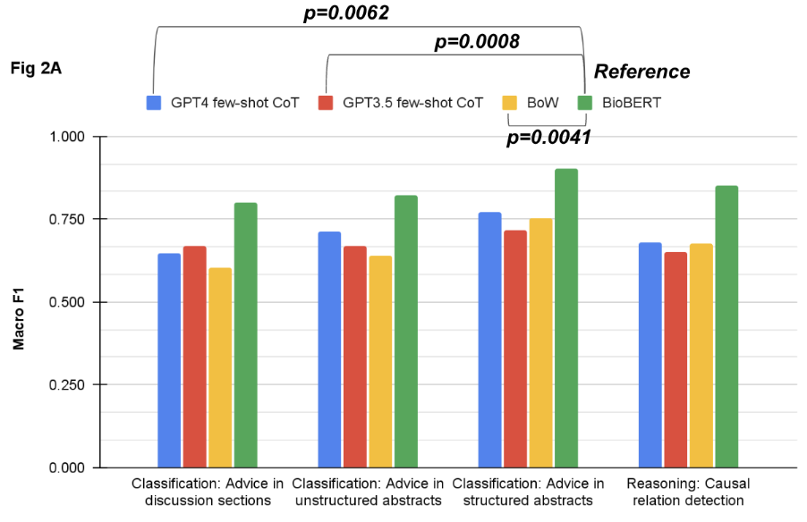
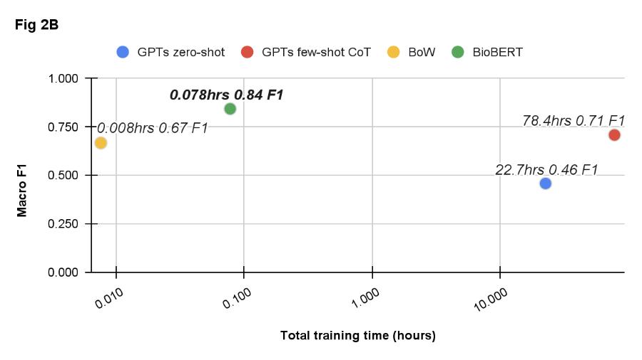

# Evaluation of ChatGPT Family of Models for Biomedical Reasoning and Classification

## Main Significances:

1. Explore accessible LLMs abilities on more dense linguistic tasks among clinical texts other than QA.
2. Use a state-of-the-art LLM, such as GPT-3, which is made available through an API, and adapt the model to the task using in-context learning.
3. Compare the results of these models across tasks give suggestion for future research (offer guidance on task appropriation model training)
4. An open source biomedical dataset with prompts and associate outputs generated by GPT series.

## Objective/Purpose:

## Materials/Methods:

Because the openAI API is a public interface, no patient data can be passed to it. Thus, we evaluated model performance on two tasks with a total of >10,000 samples as proxies for two of the most frequent tasks in the clinical domain – classification and reasoning (e.g. determining causative relationships). The first task was classifying whether statements of clinical and policy recommendations in scientific literature constitute health advice across 3 datasets. The second task was causal relation extraction from the biomedical literature in 1 dataset. We used 20% of the entire dataset as development (dev) data for the prompts under the settings of zero- and few- shots with and without chain of thought (CoT). The most effective prompt from each setting was evaluated with the remaining 80% split. We compared models using simple features (bag-of-words (BoW)) with logistic regression, and fine-tuned BioBERT models.

## Results:

Overall, fine-tuning BioBERT yielded the best results for the classification (0.80-0.90) and reasoning (F1 0.85) tasks. Of the LLM approaches, few-shot with CoT prompting yielded the best results for the classification (F1 0.67-0.77) and reasoning (F1 0.68) tasks, with results comparable to the BoW model (F1 0.60-0.75 and 0.68 for classification and reasoning, respectively) as figure 1.

The total time needed to achieve the best-performing LLM results was 78 hours, compared to 0.08 and 0.01 hours to develop the best-performing BioBERT and BoW models, respectively (as figure 2).

The total cost of the experiments through OpenAI API call was $1,299.18 USD based on pricing March 2023. 

## Conclusions:

Despite the hype around viral ChatGPT, we found that fine-tuning for our fundamental NLP tasks remained the best strategy. The simple BoW feature extractor performed on par with the most complex LLM prompting. Prompt engineering required significant time investment due to its complexity which should be taken into consideration in potential use of LLMs.

## Code structure:

The structure of this repo is quite self-explanatory.

* All the prompts are under `prompts` folder
* All the original data and folds are under `data` folder
* All the development set outputs are under `dev_outputs` folder
* All the test set outputs are under `test_outputs` folder 
* `src` holds all the .py files for all the experiment runs

## How to cite us:

Waiting for arxiv link
