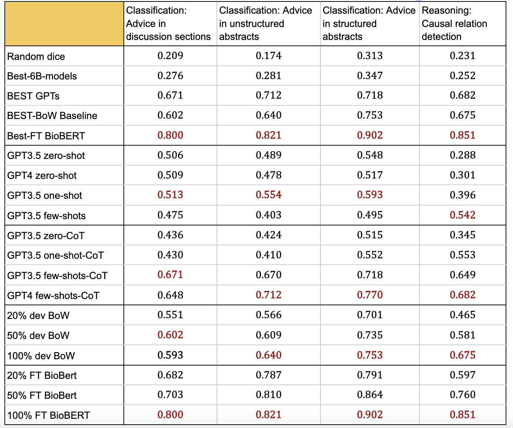

# Evaluation of ChatGPT Family of Models for Biomedical Reasoning and Classification

## Main Contributions:

1. Explore accessible LLMs abilities on more dense linguistic tasks among clinical texts other than QA
2. Use state-of-the-art LLMs, such as GPT-3.5/GPT-4, and adapt them to the task using in-context learning
3. Compare the results of these models across tasks to provide insights for future research and offer guidance on task appropriation model training
4. Provide an open source biomedical dataset with prompts and associated outputs generated by GPT series models

## Objective/Purpose:

Artificial intelligence applications in biomedicine require reliable performance with minimal errors. The recent advances in large language models (LLMs) have shown impressive ability in clinical question-answering (QA), but have not been adequately investigated for more specific biomedical use cases.  This study aims to investigate the performance of LLMs, such as the ChatGPT family of models (GPT-3.5, GPT-4) in frequent biomedical tasks beyond QA: reasoning and classification. We investigate the practical use of these models for healthcare institutions and researchers with standard computational resources, and compare their performance with classic, less computationally intensive methods.

## Materials/Methods:

Because the openAI API is a public interface, no patient data can be passed to it. Thus, we evaluated model performance on two tasks with a total of >10,000 samples as proxies for two of the most frequent tasks in the clinical domain – classification and reasoning (e.g. determining causative relationships). The first task was classifying whether statements of clinical and policy recommendations in scientific literature constitute health advice across 3 datasets. The second task was causal relation extraction from the biomedical literature in 1 dataset. We used 20% of the entire dataset as development (dev) data for the prompts under the settings of zero- and few- shots with and without chain of thought (CoT). The most effective prompt from each setting was evaluated with the remaining 80% split. We compared models using simple features (bag-of-words (BoW)) with logistic regression, and fine-tuned BioBERT models.

## Results:

Overall, fine-tuning BioBERT yielded the best results for the classification (0.80-0.90) and reasoning (F1 0.85) tasks. Of the LLM approaches, few-shot with CoT prompting yielded the best results for the classification (F1 0.67-0.77) and reasoning (F1 0.68) tasks, with results comparable to the BoW model (F1 0.60-0.75 and 0.68 for classification and reasoning, respectively) as chart0 and figure 1(all are in Macro F1).

The total time needed to achieve the best-performing LLM results was 78 hours, compared to 0.08 and 0.01 hours to develop the best-performing BioBERT and BoW models, respectively (as figure 2).

The total cost of the experiments through OpenAI API call was $1,299.18 USD based on March 2023 pricing.

## Conclusions:

Despite the hype around ChatGPT, we found that fine-tuning smaller models for our fundamental NLP tasks remained the best strategy in terms of performance and time efficiency. The simple BoW feature extractor performed on par with the most complex LLM prompting. Prompt engineering required significant time investment due to its complexity which should be taken into consideration in potential use of LLMs.

## Code structure:

The structure of this repo is quite self-explanatory.

* All the prompts are under `prompts` folder
* All the original data and folds are under `data` folder
* All the development set outputs are under `dev_outputs` folder
* All the test set outputs are under `test_outputs` folder
* `src` holds all the .py files for all the experiment runs

## Funding declaration:

R01GM114355: Funding for personnel. No involvement in manuscript writing or decision to submit for publication.
R01LM013486: Funding for personnel. No involvement in manuscript writing or decision to submit for publication.
Woods Foundation: Funding for personnel. No involvement in manuscript writing or decision to submit for publication.

## How to cite us:

Waiting for arxiv link
